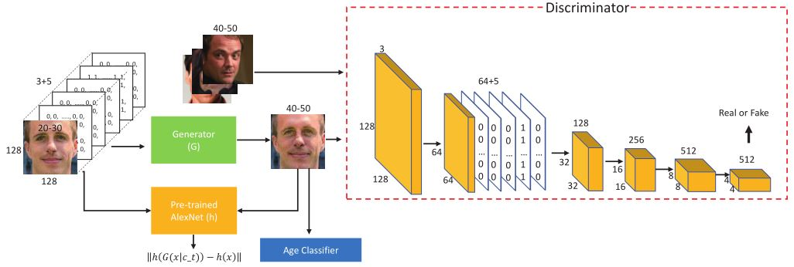
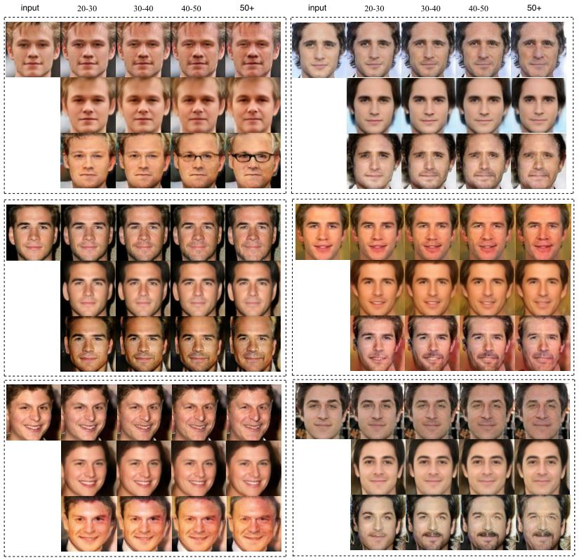
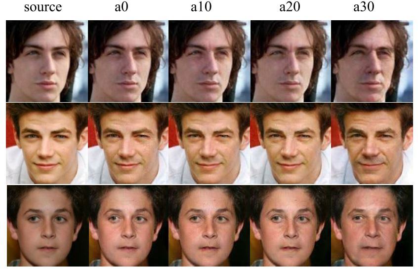
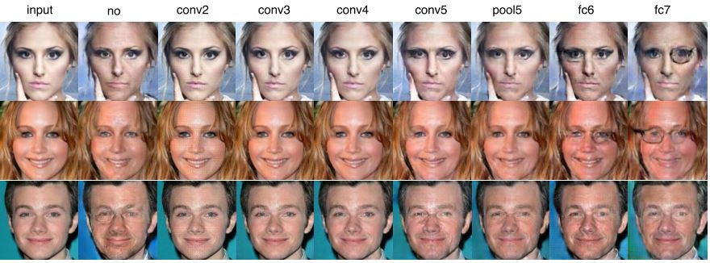

# Face Aging with Identity-Preserved Conditional Generative Adversarial Networks
This repo is the official open source of [Face Aging with Identity-Preserved Conditional Generative Adversarial Networks, CVPR 2018](http://openaccess.thecvf.com/content_cvpr_2018/papers/Wang_Face_Aging_With_CVPR_2018_paper.pdf) by Zongwei Wang, Xu Tang, Weixin Luo and Shenghua Gao. 
It is implemented in tensorflow. Please follow the instructions to run the code.


## 1. Installation
* Install 3rd-package dependencies of python (listed in requirements.txt)
```
  tensorflow-gpu==1.4.1
  scipy==1.0.0
  opencv-python==3.3.0.10
  numpy==1.11.0
  Pillow==5.1.0
```

```shell
pip install -r requirements.txt
```
* Other libraries
```code
CUDA 8.0
Cudnn 6.0
```
## 2. Download datasets
We use the Cross-Age Celebrity Dataset for training and Evaluation. More details about this dataset, please refer to (http://bcsiriuschen.github.io/CARC/). After face detection, aligning and center cropping, we split 
images into 5 age groups: 11-20, 21-30, 31-40, 41-50 and 50+.

## 3. Test on saved models
Download the trained face aging model(https://1drv.ms/u/s!AlUWwwOcwDWobCqmuFyKGIt4qaA) and place models files in checkpoints/0_conv5_lsgan_transfer_g75_0.5f-4_a30. 
* Test images are in images/test, and some training images that belong to 11-20 age group are in images/train.
```
* Running the sript to get aged faces
    python test.py
```

## 4. Train from scratch
* Firstly, download the pre-trained alexnet model(https://1drv.ms/u/s!AlUWwwOcwDWobkptownyu5fjlfU) and age classfication model(https://1drv.ms/f/s!AlUWwwOcwDWocX-Z0IJft_VbcoQ). Then unzip these files and place model files in checkpoints/pre_trained.
```shell
python age_lsgan_transfer.py \
  --gan_loss_weight=75 \
  --fea_loss_weight=0.5e-4 \
  --age_loss_weight=30 \
  --fea_layer_name=conv5 \
  --checkpoint_dir=./checkpoints/age/0_conv5_lsgan_transfer_g75_0.5f-4_a30 \
  --sample_dir=age/0_conv5_lsgan_transfer_g75_0.5f-4_a30 
```
``` shell
sh age_lsgan_transfer.py
```
* You can change the hyperparameters to adapt to your own dataset.

## 5. Experiment results
* The aging effect of different methods. Within each dot box, the first row is our result.
* The aging effect of different age classification loss weights.
* The aging effect of different feature layer.

## Citation
If you find this useful, please cite our work as follows:
```code
@INPROCEEDINGS{wang2018face_aging, 
	author={Z. Wang and X. Tang, W. Luo and S. Gao}, 
	booktitle={2018 IEEE Conference on Computer Vision and Pattern Recognition (CVPR)}, 
	title={Face Aging with Identity-Preserved Conditional Generative Adversarial Networks}, 
	year={2018}
}
```
